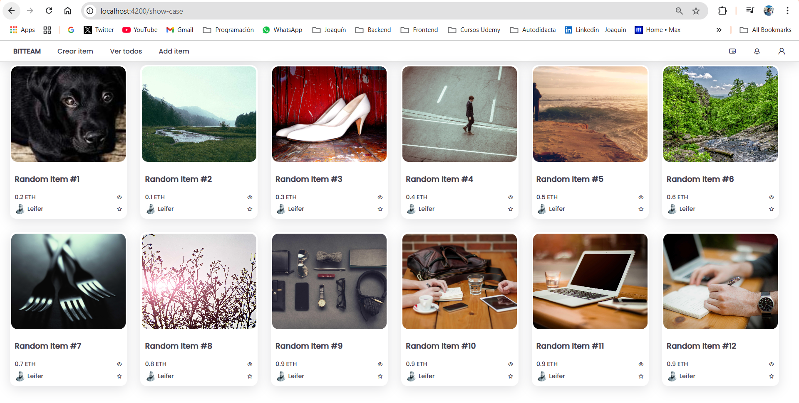
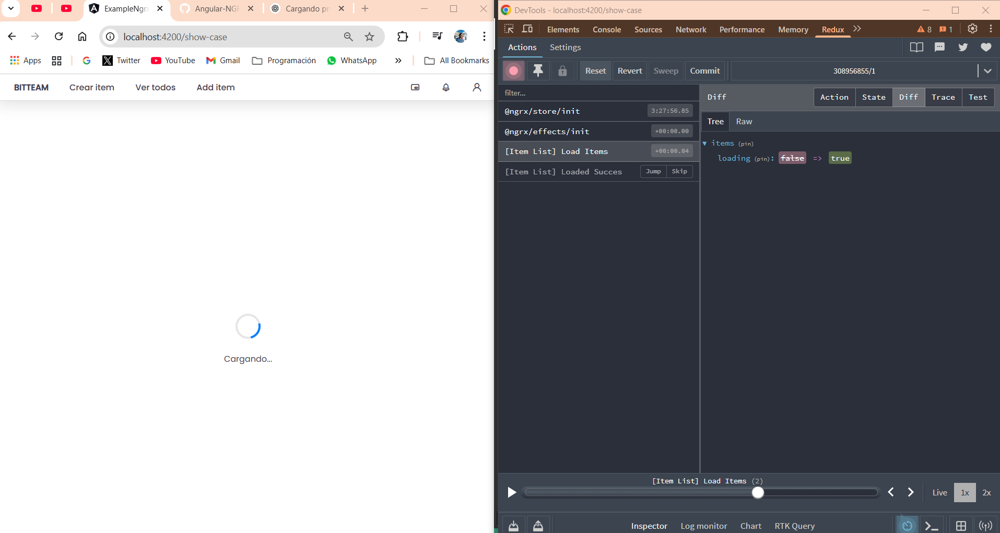
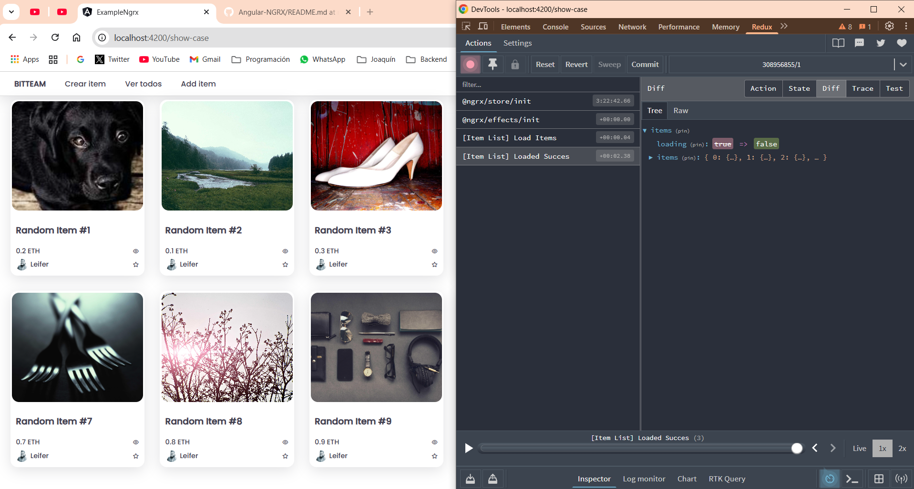
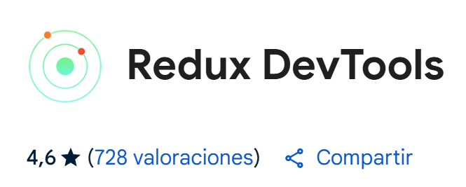

# Proyecto Angular con NGRX - Patrón de Diseño Redux
Este Proyecto fue generado con [Angular CLI](https://github.com/angular/angular-cli) version 12.2.6.
This project was generated with [Angular CLI](https://github.com/angular/angular-cli) version 12.2.6.

## ¿Qué es [NgRx](https://ngrx.io/)?
[NgRx](https://ngrx.io/) es un `framework` para crear aplicaciones reactivas en Angular. **NgRx** proporciona bibliotecas para:
- Gestión del estado global y local.
- Aislamiento de efectos secundarios para promover una arquitectura de componentes más limpia.
- Gestión de cobros de entidades.
- Integración con el routing de angular.
- Herramientas para desarrolladores que mejoran la experiencia del desarrollador al crear muchos tipos diferentes de aplicaciones.


## Desarrollo Web Página Principal.

Este proyecto tiene fines educativos y se desarrolló en base al patrón de diseño Redux NgRx. No es un documento para enseñar o aprender completamente el diseño del patrón mencionado sino que es simplemente un recordatorio del desarrollo básico y tradicional, para entender este documento es necesario tener conocimiento de la aplicación de Redux NgRx en Angular.

Run `ng serve` for a dev server. Navigate to `http://localhost:4200/`. The app will automatically reload if you change any of the source files.

Una vista del desarrollo realizado nos muestra la herramienta Redux-DevTools y lo potente que es para realizar el seguimiento de estado y acciones de nuestra aplicación:

### Acción Load Items 
Visualización de Acción previa de los items, mostrando un Spinner antes de mostrar/cargar cada items en nuestra página showCase.


### Acción Load Items 
Visualización de acción de carga exitosa de los items, mostrando el resultado de la visualización de todos los items obtenidos del Service.


Los paquetes NgRx se dividen en categorías. Para entender el desarrollo básico de Redux, nuestra aplicación trabaja como lo indica el siguiente diagrama provisto por la documentacion de NgRx:


## [Store](https://ngrx.io/guide/store)
Comenzamos instalando el paquete `@ngrx/store`:
- `ng add @ngrx/store@latest`
- `ng add @ngrx/store@12` (En esta versión de Angular).

En nuestro `app.module.ts` se nos agrega temporalmente la definición del StoreModule:
`StoreModule.forRoot({},{})`

Y luego instalamos Store-devtools:
- `ng add @ngrx/store-devtools@latest`
- `ng add @ngrx/store-devtools@12` (En esta versión de Angular).

Luego también en nuestro `app.module.ts` se nos agrega temporalmente la definición del StoreDevtoolsModule:
`StoreDevtoolsModule.instrument({ name: 'TEST' })`

Nota: En nuestro caso instalamos la extensión del navegador `Redux DevTools` para visualizar la consola de Redux vista anteriormente.


Quedando el App.module.ts ([Angular CLI](https://github.com/angular/angular-cli) version 12.2.6) de la siguiente manera:
```typescript
import { NgModule } from '@angular/core';
import { BrowserModule } from '@angular/platform-browser';
import { HttpClientModule } from '@angular/common/http';
import { AppRoutingModule } from './app-routing.module';
import { AppComponent } from './app.component';
import { StoreModule } from '@ngrx/store';
import { StoreDevtoolsModule } from '@ngrx/store-devtools';
import { ROOT_REDUCERS } from './state/app.state';

@NgModule({
  declarations: [
    AppComponent
  ],
  imports: [
    BrowserModule,
    AppRoutingModule,
    HttpClientModule,
    StoreModule.forRoot(ROOT_REDUCERS),
    StoreDevtoolsModule.instrument({ name: 'TEST' }),
  ],
  providers: [],
  bootstrap: [AppComponent]
})
export class AppModule { }
```

La estructura de nuestro proyecto la organizamos de la siguiente manera (es solo una conveción, existen otras):
<div>
  <p>/state</p>
  <ul>
    <li>├── actions/</li>
    <li>├── reducers/</li>
    <li>├── effects/  </li>
    <li>├── selectors/</li>
    <li>├── app.state.ts</li>
  </ul>
</div>

 ### ¿Qué son las FUNCIONES PURAS?
 Una **función pura** puede sonar a un concepto abstracto pero básicamente es una `función simple`, y precisamente esa simplicidad hace que no se nos dificulte entenderla. Entonces decimos que una función es pura cuando cumple con los siguientes requísitos:
- **Transparencia referencial**: Dados los mismos inputs(argumentos) siempre retorna lo mismo.
- **No tiene efectos colaterales**: No modifica variables fuera de su ámbito, ni muta sus argumentos, ni interactúa con el mundo exterior.
Este concepto será clave para entender el código que debemos desarrollar en este patrón de diseño.

### [Actions](https://ngrx.io/guide/store/actions)
Las acciones son uno de los componentes principales de NgRx. Expresan eventos únicos que ocurren en toda la aplicación. Desde la interacción del usuario con la página, la interacción externa mediante solicitudes de red y la interacción directa con las API del dispositivo, estos y otros eventos se describen con acciones.
En este archivo definimos todas las acciones que serán disparadas por nuestros componentes y que "escucharán" los reducers:
```typescript
import { ItemModel } from "@core/models/Item.interface";
import { createAction, props } from "@ngrx/store";

export const loadItems = createAction(
  '[Item List] Load Items'
)

export const loadedItems = createAction(
  '[Item List] Loaded Succes',
  props<{ items: ItemModel[] }>()
)
```


### [Reducers](https://ngrx.io/guide/store/reducers)
Los reductores en NgRx se encargan de gestionar las transiciones de un estado a otro en la aplicación. Las funciones reductoras gestionan estas transiciones determinando qué acciones gestionar según su tipo.
En el `Reducer` recibiremos la acción que se dispara y trabajaremos con los diferentes estados de la aplicación, definiendo `initialState` que incializa el `loading`  y `items` arreglo de items que utilizara nuestro componente:
```typescript
import { createReducer, on } from "@ngrx/store";
import { loadedItems, loadItems } from "../actions/items.actions";
import { ItemState } from "@core/models/items.state";

export const initialState: ItemState = { loading: false, items: []}

export const itemsReducer = createReducer(
  initialState,
  on(loadItems, (state) => {
    return { ...state, loading: true}
  }),
  on(loadedItems, (state, {items}) => {
    return { ...state, loading: false, items}
  })
)
```


### Store AppState
Aquí definimos el ESTADO INICIAL de nuestra aplicación `AppState` que luego exportaremos como una constante para registrarlo en nuestro `app.module.ts`. Esto es convencional y permite que luego se pueda definir los estados de otros componentes dentro de `AppState`.  
```typescript
import { ItemState } from "@core/models/items.state";
import { ActionReducerMap } from "@ngrx/store";
import { itemsReducer } from "./reducers/items.reducers";

// Pueden ir definidos otros datos otros componentes
export interface AppState {
  items: ItemState
}

export const ROOT_REDUCERS: ActionReducerMap<AppState> = {
  items: itemsReducer
}
```

En la carpeta `core` donde tenemos definidos nuestro Modelo de datos (carpeta `models`), creamos un archivo `item.state.ts` para definir la interfaz inicial de nuestro componente:
```typescript
import { ItemModel } from "./Item.interface";

export interface ItemState {
  loading: boolean,
  items: ReadonlyArray<ItemModel>;
}
```
Que luego integraremos en el estado inicial de nuestra aplicación General, como hemos visto anteriormente definido en `AppState`. 


### [Selectors](https://ngrx.io/guide/store/selectors)
Los `Selectors` son funciones puras que se utilizan para obtener fragmentos del estado del Store. @ngrx/store proporciona algunas funciones auxiliares para optimizar esta selección. Los selectores ofrecen diversas funciones al seleccionar fragmentos del estado:
- Portabilidad
- Memorización
- Composición
- Capacidad de prueba
- Seguridad de tipos
Al usar las funciones `createSelector` y `createFeatureSelector`, @ngrx/store registra los últimos argumentos en los que se invocó la función selectora.

```typescript
import { createSelector } from "@ngrx/store";
import { AppState } from "../app.state";

export const selectItemsFeature = (state: AppState) => state.items; //Selector PADRE "items"

// selector HIJO
export const selectListItems = createSelector(
  selectItemsFeature,
  (state) => state.items
);

// selector HIJO
export const selectLoading = createSelector(
  selectItemsFeature,
  (state) => state.loading
);
```


### [Effects](https://ngrx.io/guide/effects)
Los Efectos son un modelo de efectos secundarios basado en RxJS para Store. Utilizan flujos para proporcionar nuevas fuentes de acciones que reducen el estado según interacciones externas, como solicitudes de red, mensajes de web socket y eventos temporales. Es decir, lo que recibamos de nuestro Service (datos obtenidos de nuestra API) será la fuente de información que recibimos al disparar una determinada acción.
Primero debemos instalar `@ngrx/efectos` con los siguientes comandos:
- `ng add @ngrx/effects@latest`    
- `ng add @ngrx/effects@12` (En esta versión de Angular)

Luego desarrollamos el código en nuestro archivo `items.effects.ts` de la siguiente manera, donde `loadItem$` es un efecto creado que se activa cuando se despacha la acción `LoadItems` y lo que recibimos del `service` es un arreglo de datos que será devuelto activando la acción `LoadedItems`, dicha acción se definió con `props` que nos indica que espera un arreglo de datos llamado items del tipo `ItemModel`.

```typescript
import { Injectable } from "@angular/core";
import { ShowCaseService } from "@modules/show-case/services/show-case.service";
import { Actions, createEffect, ofType } from "@ngrx/effects";
import { EMPTY } from "rxjs";
import { map, mergeMap, catchError } from "rxjs/operators";

@Injectable()
export class ItemsEffect {

  loadItems$ = createEffect( () => this.actions$.pipe(
    ofType('[Item List] Load Items'),
    mergeMap(() => this.showCaseService.getDataApi()
    .pipe(
      map( items => ({ type: '[Item List] Loaded Succes', items})),
      catchError(() => EMPTY)
    ))
   )
  )

  constructor(
    private actions$: Actions,
    private showCaseService: ShowCaseService
  ){}
}
```


Finalmente nuestros componentes despacharán solo las acciones, así mantedremos la prolijidad de nuestro código limpio y repartiremos las responsabilidades.

## Show Case Component (Base)
### show-case.component.ts
```typescript
import { ChangeDetectionStrategy, Component, OnInit } from '@angular/core';
import { ItemModel } from '@core/models/Item.interface';
import { ShowCaseService } from '@modules/show-case/services/show-case.service';
import { Store } from '@ngrx/store';
import { Observable } from 'rxjs';
import { loadItems } from 'src/app/state/actions/items.actions';
import { selectLoading } from 'src/app/state/selectors/items.selectors';

@Component({
  selector: 'app-show-case-page',
  templateUrl: './show-case-page.component.html',
  styleUrls: ['./show-case-page.component.css'],
})
export class ShowCasePageComponent implements OnInit {
  loading$: Observable<boolean> = new Observable();
  constructor(
    private store: Store<any>
  ) { }

  ngOnInit(): void {
    
    this.loading$ = this.store.select(selectLoading)

    this.store.dispatch(loadItems());
  }
}
```


### show-case.component.html
```typescript
<div class="ui-gap">
    <div class="spinner-container" *ngIf="loading$ | async">
        <div class="spinner"></div>
        <p>Cargando...</p>
      </div>
    <!-- <app-ui-search></app-ui-search>
    <app-ui-filter></app-ui-filter> -->
    <app-ui-block-item></app-ui-block-item>
</div>
```


## UI Block Component (Show Case's Component)
Componente que lista todos los items en un cuadro de información.

### ui-block-item.component.ts
```typescript

import { Component, Input, OnInit } from '@angular/core';
import { ItemModel } from '@core/models/Item.interface';
import { Store } from '@ngrx/store';
import { Observable } from 'rxjs';
import { AppState } from 'src/app/state/app.state';
import { selectListItems } from 'src/app/state/selectors/items.selectors';

@Component({
  selector: 'app-ui-block-item',
  templateUrl: './ui-block-item.component.html',
  styleUrls: ['./ui-block-item.component.css']
})
export class UiBlockItemComponent implements OnInit {
  items$: Observable<any> = new Observable()

  constructor(
    private store: Store<AppState>
  ) {}

  ngOnInit(): void {
    this.items$ = this.store.select(selectListItems) // AQUI DISPARAMOS LA ACCIÓN
  }
}
```

### ui-block-item.component.html
```typescript
<div class="ui-block-item">
    <app-ui-item [item]="item" *ngFor="let item of items$ | async"></app-ui-item>
</div>
```

## Otros paquetes de NgRx (advanced)
### [@ngrx/signals](https://ngrx.io/guide/signals) 
NgRx Signals es una biblioteca independiente que proporciona una solución de gestión de estado reactivo y un conjunto de utilidades para Angular Signals. Es una solución de gestión de estado para aplicaciones Angular que combina lo mejor de las señales (signals) de Angular con el patrón de almacenamiento de NgRx. Sirve principalmente para:
- Gestión reactiva del estado
- Organización estructurada
- Herramientas integradas

**🚗📊 Metáfora del SignalStore:** Imagina que tu aplicación Angular es un auto de carreras. El motor son tus componentes (usan datos) y el **tablero de control** (velocímetro, combustible, etc.) es el SignalStore que te permite mostrar datos en tiempo real (señales reactivas), tiene botones para cambiar el estado (acciones/métodos) y actualiza automáticamente todas las partes del auto cuando algo cambia.


### [@ngrx/router-store](https://ngrx.io/guide/router-store)
Enlaces para conectar el router de Angular con Store. Durante cada ciclo de navegación del router, se envían múltiples acciones que permiten detectar cambios en su estado.

**🗺️🚘 Metáfora del Router-store:** Imagina tu aplicación Angular como un viaje en auto donde las carreteras y rutas son las URLs de tu app (/home, /products) y el **GPS** es el router-store. Entonces con el GPS se puede saber en todo momento dónde estás (guarda la ruta actual), te permite tomar decisiones basadas en la ubicación (ej: mostrar datos según el ID en la URL) y se registra el historial de navegación (como un viaje guardado).

To get more help on the Angular CLI use `ng help` or go check out the [Angular CLI Overview and Command Reference](https://angular.io/cli) page.
